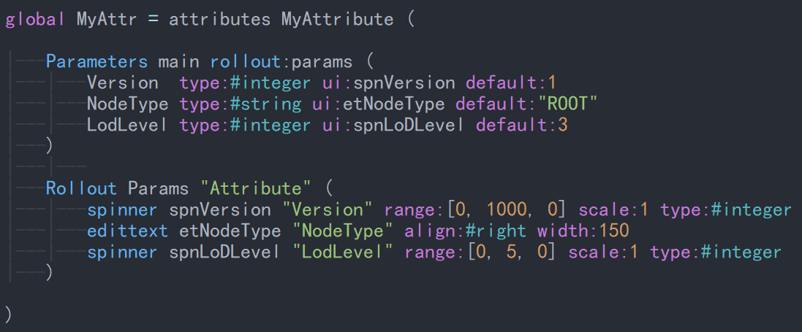

# Install

## Windows

Open file explorer, then enter %USERPROFILE% to jump to your home directory.
Copy the foler __vimfiles__ into your home directory.

## Unix-like

TODO(Merge the foler __vimfiles__ into the directory where your original __vimfiles__ is located.)
